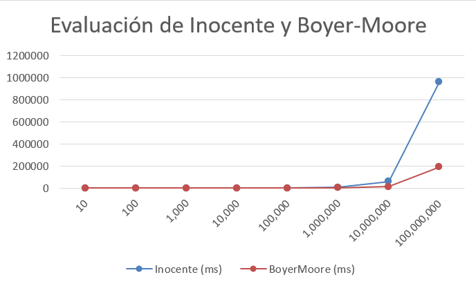

# Alumno: Anel Rojas Martinez

# String Matching

> Implementar y experimentar con los algoritmos para String Matching vistos en clase.
> Muestre la tabla comparativa con los tiempos en milisegundos y adjunte un gráfico.

## Tabla comparativa

| N    | Inocente | BoyerMoore | SuffixTree |
|------|----------|------------|------------|
| 10^1 | 0        | 5          | -          |
| 10^2 | 1        | 3          | -          |
| 10^3 | 8        | 4          | -          |
| 10^4 | 57       | 21         | -          |
| 10^5 | 598      | 194        | -          |
| 10^6 | 6977     | 1531       | -          |
| 10^7 | 60378    | 13553      | -          |
| 10^8 | 961118   | 190778     | -          |

## Gráfico

